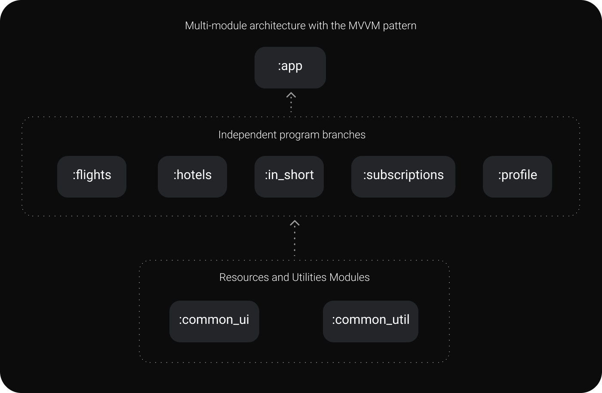
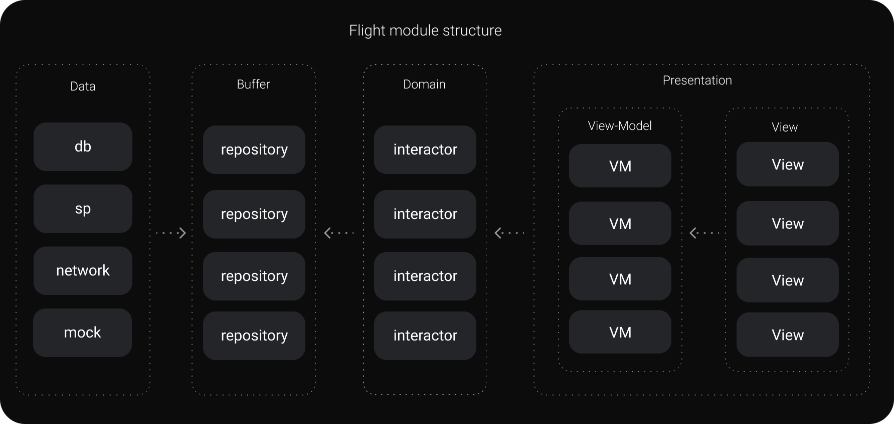
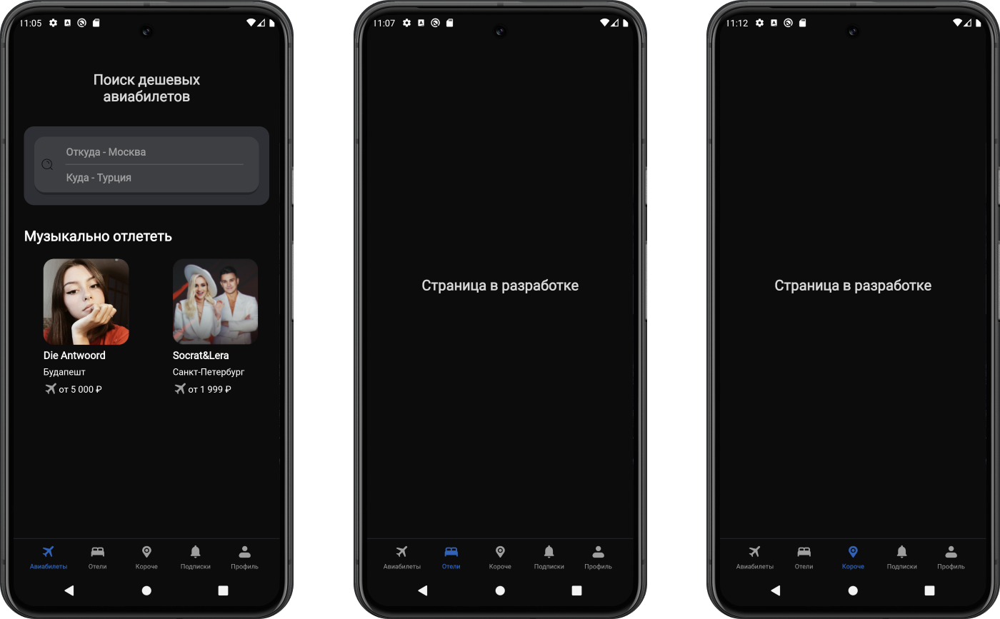
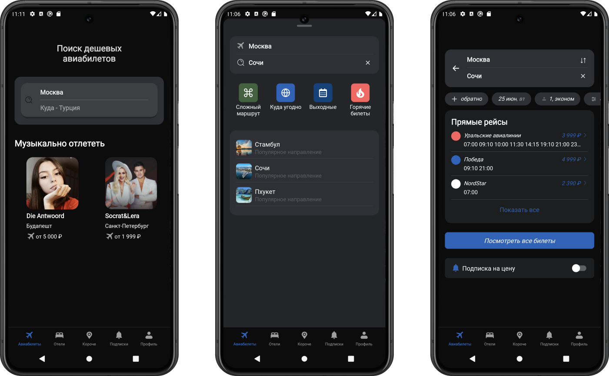
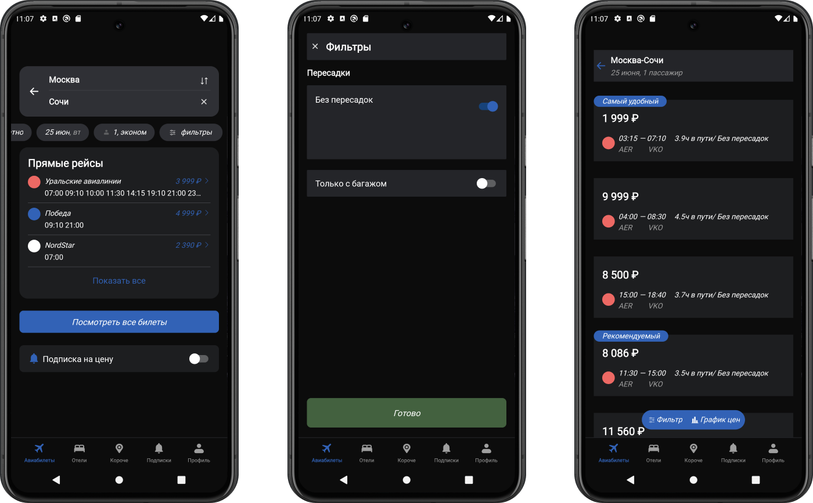

# TravelTicketApp
## Пример приложения поиска и заказа авиа-билетов
## Стек применяемых технологий:
1. Язык Kotlin
2. Многомодульная архитектура и паттерн MVVM
3. Библиотеки Koin, Glide, Gson, LiveData, Retrofit, Room
## Описание приложения:
* Для экономии вычислительных ресурсов используется принцип одной активности и множества фрагментов
* Навигация между фрагментами осуществляется с помощью NavController
* Для обеспечения стабильной работы BottomNavigationView используются вложенные навигационные граффы
* Многомодульность реализуется по следующей схеме:

* Модуль **:flights** реализован в соответствии с чистой архитектурой паттерна MVVM:

* Приложение протестированно на эмуляторе и реальном смартфоне с последующим устранением выявленных багов
* Скриншоты разработанного приложения:

Мобильное приложение разработано в учебных/образовательных целях на основе общедоступного примера [дизайна](https://www.figma.com/design/yWRLfKgmlEp7n0iKQg58hp/Effective-Mobile.-Тестовое-задание-для-разработчиков.-Продажа-авиабилетов-(Copy)) (дата обращения 23 июня 2024 года)
https://www.figma.com/design/yWRLfKgmlEp7n0iKQg58hp/Effective-Mobile.-Тестовое-задание-для-разработчиков.-Продажа-авиабилетов-(Copy)